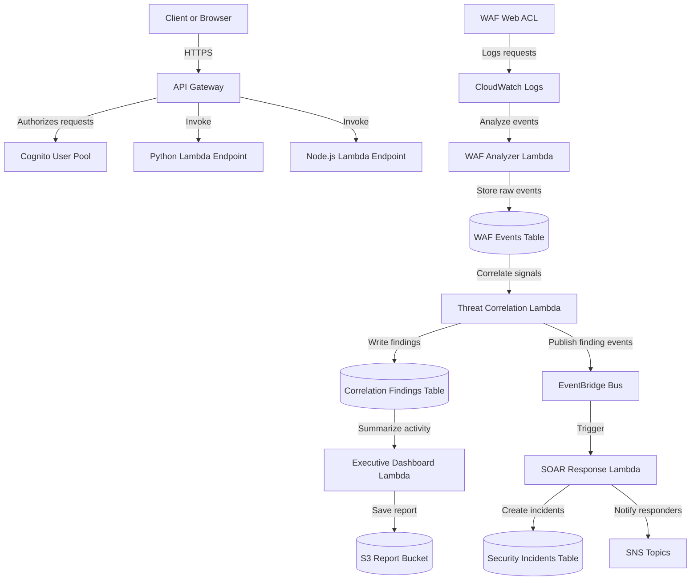

# Lab 12 - AI-Assisted Security Operations Demo

This lab provisions a small but realistic AWS security operations workflow that combines web application protection, identity-based access, serverless automation, and AI-assisted analysis. The deployment is implemented with Terraform and uses a mix of API Gateway, Cognito, WAF, Lambda, EventBridge, DynamoDB, SNS, and S3 to demonstrate how security telemetry can be collected, correlated, and acted on.

## Project overview

This project is designed to show a practical end-to-end security operations pattern:

- A protected API is exposed through API Gateway and fronted by AWS WAF.
- Access to the API is controlled by Amazon Cognito, which provides user authentication and group-based access.
- Two sample Lambda-backed endpoints are deployed: one implemented in Python and one in Node.js.
- WAF activity is captured in CloudWatch Logs and analyzed by a Lambda function that extracts meaningful events and stores them in DynamoDB.
- A threat correlation Lambda then looks for related events, creates finding records, and publishes them to EventBridge.
- A SOAR-style Lambda consumes those findings, creates security incident records, and sends notifications through SNS.
- An executive reporting Lambda summarizes the collected data and writes an executive-style report to S3.

The infrastructure is split across several Terraform files so each major capability is easy to inspect and extend:

- [api.tf](api.tf) defines the API Gateway REST API, Cognito authorizer, Lambda integrations, and deployment stage.
- [cognito.tf](cognito.tf) creates the user pool, app client, test users, groups, and parameter store values.
- [waf.tf](waf.tf) configures the WAF rules, logging, and association with the API stage.
- [db.tf](db.tf) provisions the DynamoDB tables used to store WAF events, correlation findings, and security incidents.
- [lambda.tf](lambda.tf) contains shared Lambda IAM policies and role configuration.
- [waf_analyzer_lambda.tf](waf_analyzer_lambda.tf), [waf_threat_correlation_lambda.tf](waf_threat_correlation_lambda.tf), [soar_response_agent_lambda.tf](soar_response_agent_lambda.tf), and [executive_dashboard_agent_lambda.tf](executive_dashboard_agent_lambda.tf) define the serverless workflow components.

## Architecture

## What the lab demonstrates

This lab shows how multiple AWS services can work together to support a modern security operations workflow:

1. Protect an API with WAF and Cognito.
2. Ingest and analyze security telemetry from WAF logs.
3. Correlate suspicious activity into structured findings.
4. Trigger an automated response workflow with EventBridge and SNS.
5. Generate executive-ready summaries for stakeholders.

## Notes

The deployment uses sample identities and placeholder configuration values to keep the lab self-contained. In a real production deployment, you would typically replace these values with your own domain, notification endpoints, and operational controls.

## Technologies

- AWS Cognito
- AWS API Gateway
- AWS WAF
- AWS Lambda
- AWS DynamoDB
- AWS Bedrock
- AWS S3
- Terraform

## Future Improvements for the Try Hards

- Use dynamodb streams instead of using python to put events in event bridge
- Make the project agentic by making some of the "lambda" tools for the AI (this way the agent can decide what to do based on severity and can create the executive report on a schedule)
