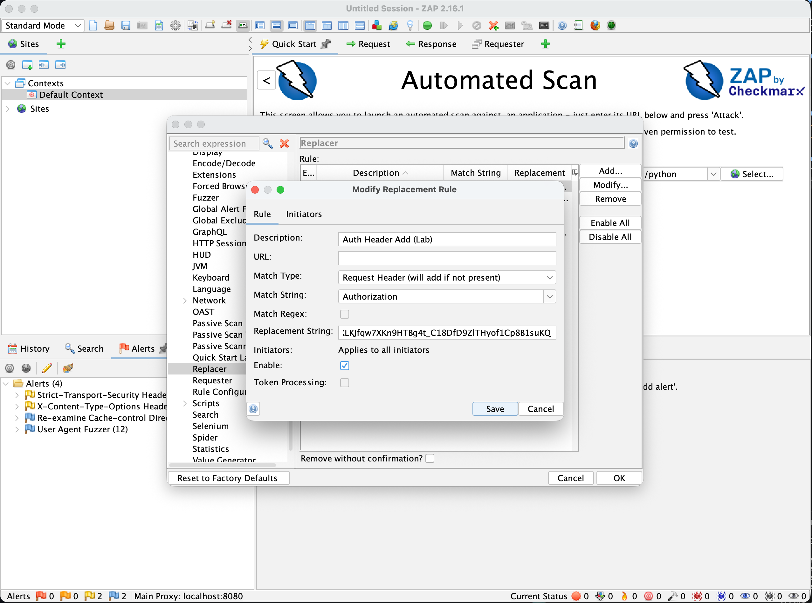

# armageddon-aws

This repository is broken into labs meant to demonstrate competency in various AWS domains.

# Labs

|Lab|Title|
|12|WAF Analyzer|

# To Dos Lab 12

- [x] Produce Bad Data with Zap
- [x] Produce bad data with vpn

# To Do Lab 12a

- [ ] Create lambda for soar-response-agent
- [ ] Update threat correlation agent to put finding id in event bridge default bus
- [ ] Create event bus rule to trigger soar-response-agent lambda
- [ ] Create sns topic to send message to

# To Do General

- [ ] Try with zap and vpn set to colombia
- [ ] Separate each lambda and it's parts into separate .tf files

# Zap

To add bearer token do the following:
Tools -> Options -> Replacer -> Add

